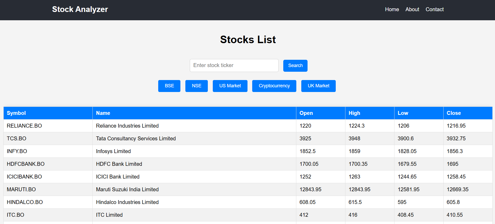
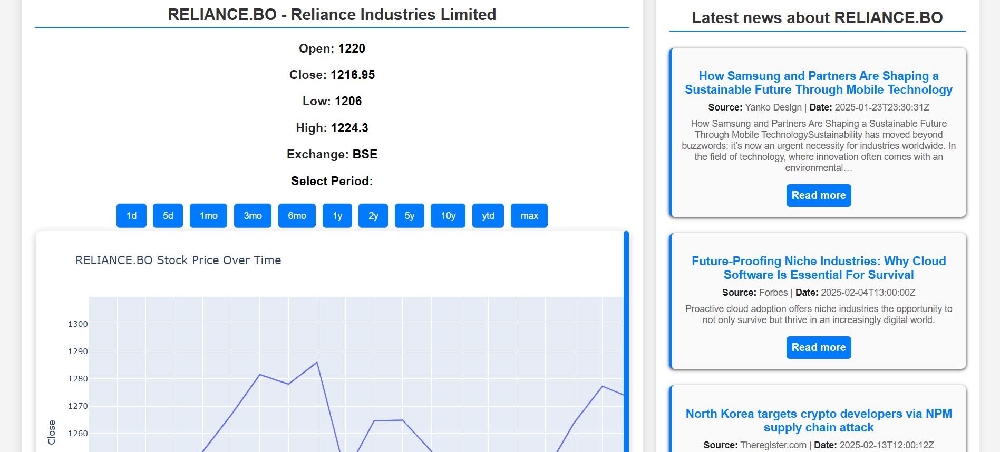
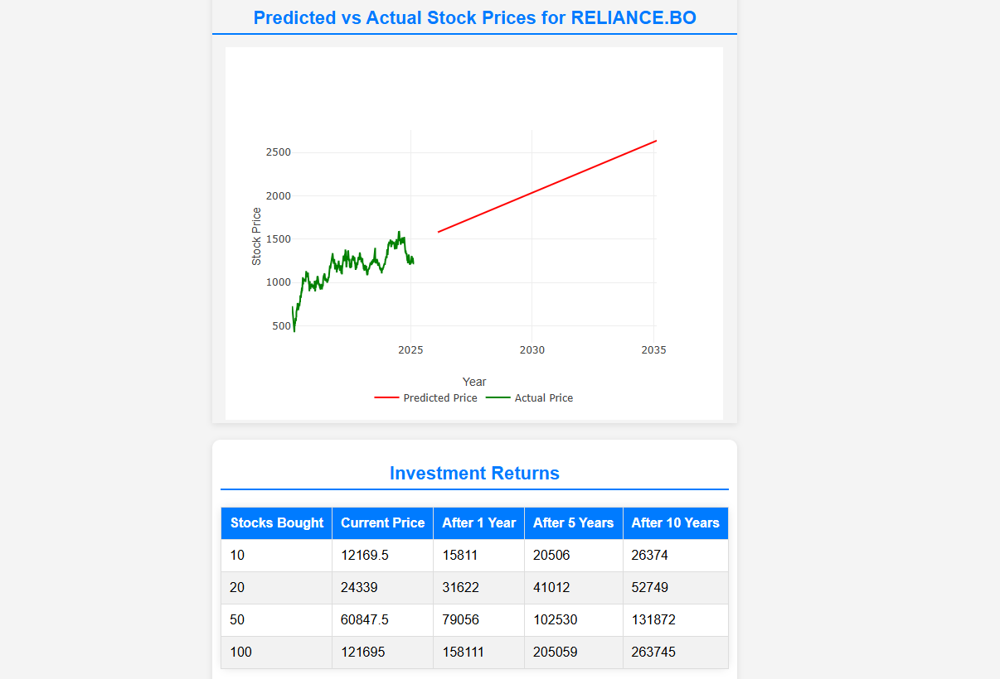
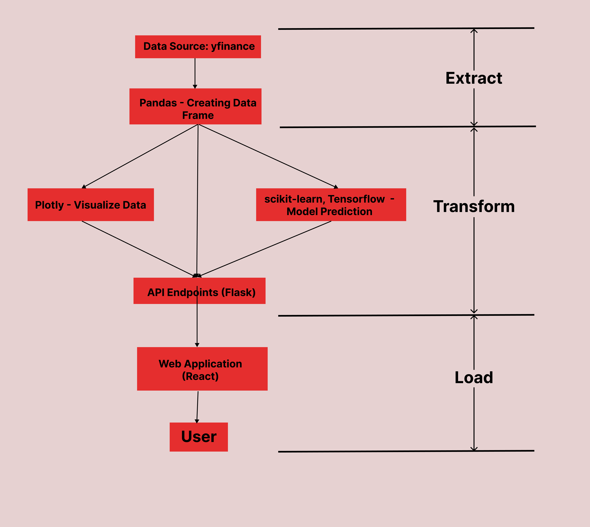

# 📈 Stock Analyzer

The **Stock Analyzer** project is a complete stock market analysis tool utilizing ML models. It allows users to input stock symbols, select date ranges, view historical stock trends, and see future stock price predictions via interactive charts.

## 🚀 Live Demo
[View Deployed App on Render](https://aistockanalyzer.onrender.com)

---

## Overview 
### 📊 Home Page  


### 📈 Stock Analysis View  


### 📈 Stock Predictions

---

## 🛠️ Technologies Used
- **React:** User Interface  
- **Plotly.js:** Interactive visualizations  
- **Axios:** API calls
- **Flask:** Backend Framework 
- **yfinance:** Stock data extraction  
- **Pandas:** Data manipulation   
- **Scikit-learn:** Machine learning models (Linear Regression, Decision Trees)   

---

## 📂 Directory Structure
```
└── srigadaakshaykumar-stock/  
   ├── README.md # Project documentation  
   ├── package.json # Node.js dependencies and scripts  
   ├── Images/  
   ├── backend/ # Backend code  
   │    ├── Model.keras # Trained machine learning model  
   │    └── app.py # Backend server code  
   ├── public/  
   │    ├── index.html  
   │    ├── manifest.json   
   │    └── robots.txt  
   └── src/   
      ├── App.css # Main stylesheet  
      ├── App.js # Main React component  
      ├── App.test.js   
      ├── index.css    
      ├── index.js  
      ├── reportWebVitals.js  
      ├── setupTests.js  
      └── components/ # Reusable React components  
         ├── Footer.jsx # Footer component  
         ├── Header.jsx # Header component  
         ├── Prediction.jsx # Prediction component  
         ├── StockList.jsx # Stock list component  
         └── Stockdata.jsx # Stock data component  
```

---

## API Endpoints
| **Endpoint**                | **Method** | **Description**                      |
|----------------------------|-----------|--------------------------------------|
| `/api/stocks/<ticker>`     | GET       | Fetch historical stock data         |
| `/api/predict/<ticker>`    | GET       | Predict future stock prices         |
| `/api/profit-calculator`   | POST      | Calculate stock returns             |

---

## Data Pipeline Architecture


---

## 📦 Installation and Running Locally
1. **Clone the repository:**  
   ```bash
   git clone https://github.com/yourusername/stock-analyzer-frontend.git
   cd stock-analyzer-frontend

2. **Install dependencies:**
   ```bash
   npm install
3. **Start the development server:**
   ```bash
   npm start

## 🤝 Contributing

Pull requests are welcome. For major changes, please open an issue first to discuss what you would like to change.
